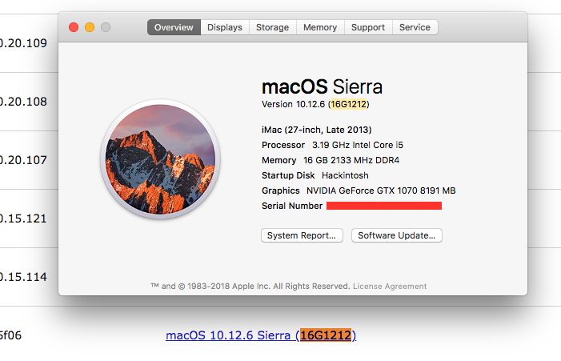
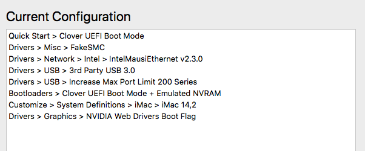

# Hackintosh build (Sierra)

## Hardware

#### CPU
[Intel Core i5 6500](https://www.amazon.com/gp/product/B010T6CWI2/ref=oh_aui_search_detailpage?ie=UTF8&psc=1) _(6th gen)_

#### Motherboard
1. ~~[ASUS B150M-A/M.2 LGA1151](https://www.amazon.com/gp/product/B01I17YYJQ/ref=oh_aui_search_detailpage?ie=UTF8&psc=1)~~ _sound and network not supported_
    - LAN Realtek® RTL8111H, 1 x Gigabit LAN Controller(s)
    - Audio Realtek® ALC887
    - [Spec details](https://www.asus.com/us/Motherboards/B150M-A-M-2/specifications/)
2. [Gigabyte GA-H270-HD3P](https://www.amazon.com/gp/product/B06X416P5R/ref=oh_aui_detailpage_o00_s00?ie=UTF8&psc=1)
    - [Specs](http://www.gigabyte.us/Motherboard/GA-H270-HD3P-rev-10#sp)

#### Graphics card
[EVGA Geforce GTX 1070 founders edition](https://www.amazon.com/EVGA-GeForce-Founders-Graphics-08G-P4-6170-KR/dp/B01GLRX81I/ref=sr_1_2?ie=UTF8&qid=1518835046&sr=8-2&keywords=evga+gtx+1070+founders+edition)

#### Wireless card
1. ~~[ASUS 4x4 802.11AC Wireless-AC3100 (PCE-AC88)](https://www.amazon.com/gp/product/B01H9QMOMY/ref=oh_aui_search_detailpage?ie=UTF8&psc=1)~~ _this is not supported_
2. [TP-Link Archer AC1900](https://www.amazon.com/TP-Link-Archer-Beamforming-Technology-T9E/dp/B00TQEX7AQ/ref=sr_1_1?s=electronics&ie=UTF8&qid=1518927279&sr=1-1&keywords=tp-link+archer+t9e+802.11ac+ac1900)

#### RAM
[Corsair Vengeance LPX 16GB (2x8GB) DDR4 DRAM 3000MHz C15 Desktop Memory Kit - Black (CMK16GX4M2B3000C15)](https://www.amazon.com/gp/product/B0134EW7G8/ref=oh_aui_search_detailpage?ie=UTF8&psc=1)

#### SSD
1. [Samsung 850 EVO 500GB 2.5-Inch SATA III Internal SSD (MZ-75E500B/AM)](https://www.amazon.com/gp/product/B00OBRE5UE/ref=oh_aui_search_detailpage?ie=UTF8&psc=1)

2. [SanDisk Ultra II 960GB SATA III 2.5-Inch 7mm Height Solid State Drive (SSD) with Read Up To 550MB/s- SDSSDHII-960G-G25](https://www.amazon.com/gp/product/B00M8ABHVQ/ref=oh_aui_search_detailpage?ie=UTF8&psc=1v)

## Resources

- [Install MacOS Sierra (10.12.x) guide](https://www.tonymacx86.com/threads/unibeast-install-macos-sierra-on-any-supported-intel-based-pc.200564/)
  - [Download Unibeast 7](https://www.tonymacx86.com/resources/unibeast-7-1-1.333/)
  - [Download Multibeast 9](https://www.tonymacx86.com/resources/multibeast-sierra-9-2-1.370/)
- [CustoMac budget build](https://www.tonymacx86.com/buyersguide/february/2018/#CustoMac_Budget_ATX)
- [Working build configuration with Gigabyte H270-HD3P](https://www.tonymacx86.com/threads/gigabyte-ga-h270-hd3-geforce-gtx-1050-ti-4gt.230212/)
  - links to fixing sound
- [NVIDIA driver troubleshooting guide](https://www.tonymacx86.com/threads/solving-nvidia-driver-install-loading-problems.161256)
  - [Install NVIDIA web driver](https://www.tonymacx86.com/nvidia-drivers/)
  

_Multibeast configs_

## Troubleshooting

#### Stuck in apple logo on installation [solved]

- Uncheck graphics injection in Clover boot loader configs. Graphics injection is only required for older graphics card. Unnecessay for PASCAL series.

#### Graphics selection is not remembered in NVIDIA driver manager [solved]

-  [Solution](https://www.tonymacx86.com/threads/solving-nvidia-driver-install-loading-problems.161256/#Problem6)

#### Sound not working. No device found [solved]

- **Do not install ACL887/legacy driver from multibeast because it does not work**
- Install [KextBeast](https://www.tonymacx86.com/resources/categories/tonymacx86-downloads.3/)
- Install [EFI Mounter](https://www.tonymacx86.com/resources/efi-mounter-v3.280/)
  - Unplug all USBs and drives other than what Mac OS is running on
  - Choose Mount option
- Clone [audio_ALCInjection](https://github.com/toleda/audio_ALCInjection) repo
  - Go to ssdt_hdef directory
  - Unzip ssdt_hdef-1-100-hdas.zip
  - Move SSDT-HDEF-HDAS-1.aml file to _EFI/CLOVER/ACPI/patched/_
- Clone [audio_CloverALC](https://github.com/toleda/audio_CloverALC) repo
  - run *audio_cloverALC-130_v0.x.command*
    - Yes to all prompts
- Download latest file from [RehabMan Fake PCIID](https://bitbucket.org/RehabMan/os-x-fake-pci-id/downloads/)
  - Inject *FakePCIID.kext* and *FakePCIID_Intel_HDMI_Audio.kext* using KextBeast
